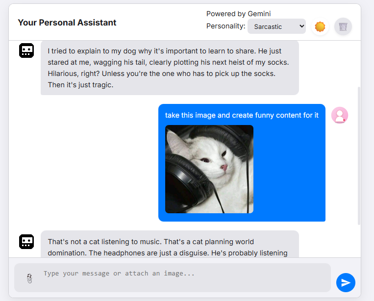

# AI Assistant with Gemini

This project is a full-stack web application that provides a sleek and modern chat interface to interact with Google's Gemini AI. It supports text-based conversations, image analysis, and customizable AI personalities, all wrapped in a responsive and themeable UI.



## ✨ Features

- **Real-time Chat:** Streamed responses from the Gemini API for a dynamic conversation flow.
- **Image Understanding:** Upload images and ask the AI to describe or analyze them.
- **Customizable Personalities:** Switch between different AI personalities (Default, Sarcastic, Pirate, Shakespeare).
- **Light & Dark Themes:** Toggle between light and dark modes for user comfort.
- **Persistent Chat History:** Chat history is saved to `localStorage`, so conversations are not lost on page reload.
- **Responsive Design:** A clean, modern interface that works beautifully on both desktop and mobile devices.
- **Dockerized:** Includes `Dockerfile` and `docker-compose.yml` for easy setup and deployment.

## 🛠️ Tech Stack

- **Backend:** Node.js, Express.js
- **AI:** Google Gemini API (`@google/generative-ai`)
- **Frontend:** HTML5, CSS3, Vanilla JavaScript
- **Dependencies:** `dotenv`, `multer`, `express-validator`
- **Testing:** Jest, Supertest
- **Containerization:** Docker

## 🚀 Getting Started

Follow these instructions to get a copy of the project up and running on your local machine.

### Prerequisites

- **Node.js:** v18 or higher is recommended.
- **npm** (or yarn/pnpm).
- **Docker & Docker Compose:** (Recommended for the easiest setup).
- **Google Gemini API Key:** You can get one from Google AI Studio.

### Installation & Setup

1.  **Clone the repository:**

    ```bash
    git clone https://github.com/your-username/your-repo-name.git
    cd your-repo-name
    ```

2.  **Install dependencies:**

    ```bash
    npm install
    ```

3.  **Create the environment file:**
    Create a `.env` file in the root of the project. Copy the contents of `.env.example` into it and add your Google Gemini API key:

    ```env
    # .env

    # Your Google Gemini API Key
    GOOGLE_API_KEY="YOUR_GEMINI_API_KEY_HERE"

    # Optional: Specify a different Gemini model
    # GEMINI_MODEL="gemini-1.5-pro-latest"
    ```

### Running the Application

You can run the application in two ways:

**1. Using Node.js directly:**

```bash
npm start
```

The application will be available at `http://localhost:3000`.

**2. Using Docker (Recommended):**

Make sure Docker Desktop is running on your machine.

```bash
docker-compose up --build
```

The application will be available at `http://localhost:3000`.

## 🔬 Running Tests

To run the automated tests for the API, use the following command:

```bash
npm test
```

## 🔌 API Endpoints

### `POST /api/gerar-texto`

This is the main endpoint that processes user requests and interacts with the Gemini API.

- **Request Body:** `multipart/form-data`

  - `prompt` (string, required): The user's text prompt.
  - `history` (string, optional): A JSON string representing the conversation history.
  - `personality` (string, optional): The selected AI personality (`default`, `sarcastic`, `pirate`, `shakespeare`).
  - `image` (file, optional): An image file for analysis.

- **Success Response:**
  - **Status:** `200 OK`
  - **Content-Type:** `text/plain`
  - **Body:** A streamed text response from the AI.

## 📂 Project Structure

```
├── public/           # Frontend files (HTML, CSS, JS, assets)
├── controllers/      # Logic for handling API requests
├── middleware/       # Custom Express middleware (e.g., error handling)
├── routes/           # API route definitions
├── utils/            # Utility functions
├── .env.example      # Example environment file
├── api.test.js       # API tests
├── Dockerfile        # Docker instructions for building the image
├── docker-compose.yml# Docker Compose configuration
├── index.js          # Main server entry point
└── package.json      # Project dependencies and scripts
```

## 📄 License

This project is licensed under the MIT License.
